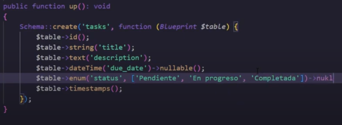

## LARAVEL
instalar laravel
```
#### composer global require laravel/installer

```
#### crear proyecto con laravel instalado

```
laravel new mi_proyecto
```

#### crear proyecto sin instalar laravel:
ir a la carpeta del proyecto donde desea crearse el proyecto
C://wamp64/www 
```
composer create-project laravel/laravel laravel-diez
```

abrir el proyecto en visual studio code
```
code. 
```

### ARTISAN
Artisan es la interfaz de línea de comandos de Laravel

#### ver todos los comandos
```
php artisan list
```

#### crear controladores y modelos
```
php artisan make:controller UserController

php artisan make:model NombreDelModelo
```


#### migrar base de datos
```
php artisan migrate
```

#### Ejecutar un servidor de desarrollo
```
php artisan serve
```
#### Limpieza y mantenimiento:
```
php artisan config:cache
```
### Consideraciones:
Para las vistas se nombre de esta manera

```
namefile.blade.php
```

#### web.php

importar controlardor
```
user App\Controller\UserController;
...
Route::get('/users', [UserController::class, 'index']);
Route::resource('tasks',TaskController::class);
```

#### CONTROLADORES
en singular con respecto a la base de datos
```
user Illuminate\View\View

class UserController extends Controller
{
    public function index(int $user_id): view
    {
        // dd();
        $user = User::find($user_id);
        dd(User::all());

        return view('welcome',['lup' => $user]);
        return view('welcome');
    }
}
```

#### Base de datos

    ##### ELOCUENT:
    Eloquent es el ORM (Object-Relational Mapping) de Laravel. Es una herramienta que simplifica el trabajo con bases de datos, permitiendo interactuar con tablas y registros de manera más intuitiva y natural, utilizando objetos en lugar de escribir consultas SQL directamente.

se configura en el archivos .env


crear tabla para migracion en CLI:

app->database->migrations
```
php artisan make:migration create_posts_table 
```


#### MODELOS
en singular con respecto a la base de datos

para usar en controlador hay que importar

```
use App\Models\User;
```
#### VISTAS

```
<p>{{$user->name}}</p>
```
crear CRUD completo, controlador y modelo:
php artisan make:controller TaskController --resource --model=task

### ELOCUENT

```
use App\Models\Post;

// Crear un nuevo registro
$post = new Post;
$post->title = 'Mi primer post';
$post->content = 'Este es el contenido';
$post->save();

// Obtener todos los posts
$posts = Post::all();

// Encontrar un post por ID
$post = Post::find(1);

// Actualizar un post
$post->title = 'Nuevo título';
$post->save();

// Eliminar un post
$post->delete();
```
### MIGRATIONS
Se encuentra en database->migrations:



